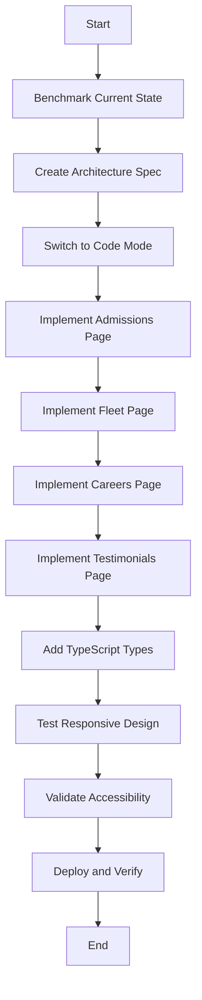

# Architecture Specification: Page Redesign using BMAD Methodology

## Benchmark: Current State Analysis

### Existing Pattern (from `/programs` and `/apply` pages):
- **No Header/Footer imports** - Pages rely on root layout
- **shadcn/ui components** - Card, Button, Badge, Tabs, Input, Select, etc.
- **Tailwind utility classes** - Responsive design with sm:, md:, lg: prefixes
- **TypeScript** - Proper type definitions
- **Semantic HTML** - section, div, main structure
- **Next.js App Router** - Metadata exports, client components when needed

### Design System from Existing Pages:
- **Colors**: Red primary (#dc2626), Gold secondary (#d97706), Blue accent (#1e40af)
- **Typography**: Inter (sans), Playfair Display (serif)
- **Spacing**: Tailwind scale (4px base)
- **Components**: Cards with gradients, badges, icons from lucide-react

## Modify: Unique Page Designs

### 1. Admissions Page Design
**Purpose**: Multi-step application process with progress tracking

**Layout Structure**:
```
<section> Hero with application steps overview
<section> Multi-step form with progress indicators
  - Step 1: Personal Information
  - Step 2: Educational Background  
  - Step 3: Program Selection
  - Step 4: Document Upload
  - Step 5: Review & Submit
<section> Application requirements checklist
<section> FAQs accordion
<section> Contact support CTA
```

**Key Components**:
- Stepper/Progress indicator (custom or from shadcn/ui)
- Form with validation (react-hook-form + zod)
- File upload component
- Checklist with icons
- Accordion for FAQs

**Unique Features**:
- Real-time form validation
- Save progress functionality
- Document preview before upload
- Estimated completion time

### 2. Fleet Page Design
**Purpose**: Showcase aircraft with detailed specifications

**Layout Structure**:
```
<section> Hero with fleet overview stats
<section> Filter bar (aircraft type, availability, category)
<section> Aircraft grid with cards
<section> Modal/Dialog for aircraft details
  - Image gallery
  - Technical specifications table
  - Booking/inquiry form
<section> Fleet statistics infographic
<section> Maintenance & safety standards
```

**Key Components**:
- Filter buttons with active states
- Grid layout with responsive columns
- Dialog/Modal from shadcn/ui
- Image carousel for aircraft photos
- Data tables for specifications
- Badge for availability status

**Unique Features**:
- Filterable aircraft list
- Modal with image gallery
- Technical specs in structured format
- Availability calendar integration

### 3. Careers Page Design
**Purpose**: Job listings with application drawer

**Layout Structure**:
```
<section> Hero - Join our team
<section> Why work at APG (benefits cards)
<section> Job category filters
<section> Job listings grid
<section> Application drawer/sheet
  - Job details
  - Requirements checklist
  - Quick apply form
<section> Employee testimonials carousel
<section> Culture & values
```

**Key Components**:
- Category filter tabs
- Job card component with badges
- Drawer/Sheet from shadcn/ui
- Form in drawer
- Carousel for testimonials
- Badge for job type (Full-time, Part-time, Contract)

**Unique Features**:
- Filter by department, location, type
- Drawer slides in with job details
- Quick apply vs full application
- Share job functionality

### 4. Testimonials Page Design
**Purpose**: Student success stories with ratings

**Layout Structure**:
```
<section> Hero - Success stories
<section> Featured testimonial spotlight
<section> Filter by program/year
<section> Testimonials masonry grid OR carousel
  - Student photo
  - Quote
  - Star rating
  - Program & graduation year
  - Current position
<section> Video testimonials
<section> Alumni network CTA
```

**Key Components**:
- Masonry grid (CSS or library)
- OR Carousel/Swiper for testimonials
- Star rating component
- Video player embed
- Filter dropdowns
- Avatar component

**Unique Features**:
- Masonry layout for varied card heights
- Video testimonials with play controls
- Filter by program, year, employer
- Shareable testimonial cards

## Assess: Technical Requirements

### TypeScript Requirements:
```typescript
// Page component type
export default function PageName(): JSX.Element

// Metadata export
export const metadata: Metadata = {
  title: string,
  description: string,
  keywords: string,
}

// Component props types
interface ComponentProps {
  // typed props
}
```

### Accessibility Checklist:
- [ ] All interactive elements have proper ARIA labels
- [ ] Semantic HTML (header, main, section, article, nav, footer)
- [ ] Keyboard navigation with visible focus states
- [ ] Color contrast ratios meet WCAG AA (4.5:1)
- [ ] Alt text for all images
- [ ] Form labels properly associated
- [ ] Skip links for navigation
- [ ] Heading hierarchy (h1 → h2 → h3)

### Responsive Design:
- Mobile-first approach
- Breakpoints: sm (640px), md (768px), lg (1024px), xl (1280px)
- Grid/Flex layouts that adapt
- Touch-friendly tap targets (min 44x44px)
- Readable text sizes on mobile

### Component Patterns:
- Use existing shadcn/ui components
- Follow Card → CardHeader → CardTitle/CardDescription → CardContent pattern
- Consistent spacing with Tailwind utilities
- Reuse icon components from lucide-react
- Maintain color scheme: Red, Gold, Blue accents

## Deploy: Implementation Steps

1. **Delete placeholder pages** - Remove current `/program`, `/admissions`, `/fleet`, `/careers`, `/testimonials`
2. **Implement admissions** - Multi-step form with progress
3. **Implement fleet** - Grid with modal views
4. **Implement careers** - Job cards with drawer
5. **Implement testimonials** - Masonry/carousel layout
6. **Add metadata** - SEO optimization for each page
7. **Test responsive** - Verify across breakpoints
8. **Validate accessibility** - ARIA, keyboard nav, contrast
9. **Performance check** - Image optimization, lazy loading

## Mermaid: Implementation Flow



## Success Criteria

- ✅ Each page has unique, production-ready design
- ✅ No duplicate Header/Footer components
- ✅ Proper TypeScript types throughout
- ✅ All shadcn/ui components used correctly
- ✅ Responsive across mobile, tablet, desktop
- ✅ WCAG AA accessibility compliance
- ✅ Semantic HTML5 structure
- ✅ Consistent design language with homepage
- ✅ Optimal performance (Next.js Image, lazy loading)
- ✅ SEO-optimized metadata