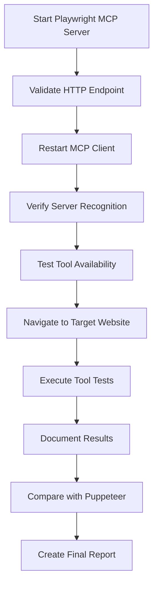

# Comprehensive MCP Playwright Testing & Verification Plan

## Executive Summary

This document outlines a comprehensive plan to install, configure, test, and verify the Microsoft Playwright MCP server integration with the development environment. The plan includes detailed validation steps, troubleshooting protocols, and testing procedures for both Playwright and Puppeteer MCP servers.

## Current State Assessment

- **Current Configuration**: `.kilocode/mcp.json` contains only GitHub MCP server configuration
- **Playwright MCP Status**: Needs complete reinstallation and configuration from scratch
- **Target Website**: https://9000-firebase-geminiapgwebsite1-1759806964631.cluster-fkltigo73ncaixtmokrzxhwsfc.cloudworkstations.dev/
- **Designated Port**: 8931 for Playwright MCP server

## Implementation Plan

### Phase 1: Installation & Setup

#### 1.1 Research and Download Official Playwright MCP Server
- **Objective**: Obtain the official Microsoft Playwright MCP server
- **Actions**:
  - Clone the official Microsoft Playwright MCP repository
  - Review documentation and installation requirements
  - Identify dependencies and system requirements
  - Verify compatibility with current environment

#### 1.2 Install Playwright MCP Server
- **Objective**: Install Playwright MCP server globally and locally
- **Actions**:
  - Install Playwright MCP server globally using npm
  - Install project-specific dependencies
  - Verify Playwright browser binaries are installed
  - Configure environment variables if needed

#### 1.3 Configure MCP Settings
- **Objective**: Update `.kilocode/mcp.json` with Playwright MCP configuration
- **Actions**:
  - Add Playwright MCP server configuration to `.kilocode/mcp.json`
  - Configure HTTP endpoint on port 8931
  - Set proper server parameters and options
  - Backup existing configuration before changes

### Phase 2: Server Validation

#### 2.1 Server Startup Validation
- **Objective**: Ensure Playwright MCP server starts correctly
- **Validation Steps**:
  - Start Playwright MCP server on designated port
  - Verify process is running and listening on port 8931
  - Check server logs for any startup errors
  - Confirm server responds to health checks

#### 2.2 HTTP Endpoint Accessibility
- **Objective**: Validate HTTP endpoint is accessible and functional
- **Testing Methods**:
  - Use curl to test HTTP endpoint connectivity
  - Verify JSON-RPC protocol responses
  - Test with sample requests and validate responses
  - Check CORS headers if needed

#### 2.3 MCP Communication Testing
- **Objective**: Test basic MCP server communication
- **Test Cases**:
  - Send JSON-RPC initialization request
  - Verify server capabilities response
  - Test tool listing functionality
  - Validate error handling and responses

### Phase 3: Client Integration

#### 3.1 MCP Client Recognition
- **Objective**: Ensure MCP client recognizes new server configuration
- **Steps**:
  - Restart MCP client/application
  - Verify Playwright server appears in available servers
  - Check client logs for connection status
  - Troubleshoot connection issues if needed

#### 3.2 Tool Availability Verification
- **Objective**: Confirm Playwright MCP tools are accessible
- **Verification Steps**:
  - List all available tools from Playwright server
  - Verify core browser automation tools are present:
    - `browser_navigate`
    - `browser_screenshot`
    - `browser_click`
    - `browser_type`
    - `browser_hover`
    - `browser_evaluate`
  - Test tool metadata and descriptions

### Phase 4: Functional Testing

#### 4.1 Browser Navigation Testing
- **Objective**: Test browser navigation with target website
- **Test Scenarios**:
  - Navigate to the target website URL
  - Verify page loads completely
  - Check for any navigation errors
  - Validate page title and content

#### 4.2 Comprehensive Tool Testing
- **Objective**: Test all Playwright MCP tools functionality
- **Test Matrix**:
  - **Navigation**: URL loading, page refresh, back/forward
  - **Interaction**: Click buttons, fill forms, hover elements
  - **Content**: Take screenshots, extract text, evaluate JavaScript
  - **Advanced**: Handle alerts, manage tabs, download files

### Phase 5: Protocol Documentation

#### 5.1 Testing Protocol Creation
- **Objective**: Create standardized testing procedures
- **Documentation**:
  - Step-by-step testing procedures
  - Expected results and validation criteria
  - Test data and sample requests
  - Performance benchmarks

#### 5.2 Troubleshooting Guide
- **Objective**: Document common issues and solutions
- **Troubleshooting Areas**:
  - Server startup failures
  - Client connection issues
  - Tool execution errors
  - Performance optimization

#### 5.3 Dual Server Protocol
- **Objective**: Establish testing for both Playwright and Puppeteer MCP
- **Comparison Testing**:
  - Feature parity verification
  - Performance comparison
  - Compatibility testing
  - Use case recommendations

## Technical Architecture

### MCP Server Configuration Structure
```json
{
  "mcpServers": {
    "playwright": {
      "command": "node",
      "args": ["./node_modules/@playwright/mcp/dist/index.js"],
      "env": {
        "PLAYWRIGHT_BROWSER": "chromium",
        "PLAYWRIGHT_HEADLESS": "true"
      }
    },
    "github": {
      "command": "docker",
      "args": ["run", "-i", "--rm", "..."]
    }
  }
}
```

### Testing Workflow Diagram


## Validation Checklist

### Pre-Installation Checklist
- [ ] Node.js version compatibility verified
- [ ] Sufficient disk space available
- [ ] Network access to npm registry
- [ ] Backup of existing `.kilocode/mcp.json`

### Installation Validation
- [ ] Playwright MCP server installed globally
- [ ] Project dependencies installed
- [ ] Browser binaries downloaded
- [ ] Environment variables configured

### Configuration Validation
- [ ] `.kilocode/mcp.json` updated correctly
- [ ] Server configuration syntax valid
- [ ] Port 8931 availability confirmed
- [ ] HTTP endpoint configured

### Functional Validation
- [ ] Server starts without errors
- [ ] HTTP endpoint responds correctly
- [ ] MCP client recognizes server
- [ ] Tools appear in available tools list
- [ ] Basic navigation test successful
- [ ] All tools function correctly

## Performance Benchmarks

### Server Startup Time
- **Target**: < 5 seconds
- **Measurement**: Time from command to ready state

### Tool Response Time
- **Navigation**: < 3 seconds
- **Screenshot**: < 2 seconds
- **Element Interaction**: < 1 second

### Memory Usage
- **Idle State**: < 100MB
- **Active Browsing**: < 500MB

## Error Handling & Recovery

### Common Error Scenarios
1. **Port Already in Use**
   - Solution: Change port or kill conflicting process
   
2. **Browser Binary Missing**
   - Solution: Run Playwright browser installation
   
3. **MCP Client Connection Failed**
   - Solution: Restart client and verify configuration
   
4. **Tool Execution Timeout**
   - Solution: Increase timeout or optimize page load

### Recovery Procedures
1. **Server Restart**: Automated restart script
2. **Configuration Reset**: Restore from backup
3. **Client Reconnection**: Force client refresh
4. **Full Reinstall**: Clean installation procedure

## Security Considerations

### Access Control
- Restrict server access to localhost
- Implement authentication if needed
- Validate all input parameters

### Data Protection
- No sensitive data in logs
- Secure file handling for downloads
- Proper cleanup of temporary files

## Final Deliverables

1. **Functional Playwright MCP Server**: Fully installed and configured
2. **Testing Documentation**: Complete testing procedures and results
3. **Troubleshooting Guide**: Common issues and solutions
4. **Comparison Report**: Playwright vs Puppeteer analysis
5. **Implementation Checklist**: Validation checklist for future deployments

## Timeline Estimate

- **Phase 1**: 2-3 hours (Installation & Setup)
- **Phase 2**: 1-2 hours (Server Validation)
- **Phase 3**: 1 hour (Client Integration)
- **Phase 4**: 2-3 hours (Functional Testing)
- **Phase 5**: 2-3 hours (Protocol Documentation)

**Total Estimated Time**: 8-12 hours

## Success Criteria

1. ✅ Playwright MCP server installed and running on port 8931
2. ✅ MCP client recognizes and connects to Playwright server
3. ✅ All Playwright tools accessible and functional
4. ✅ Successful navigation to target website
5. ✅ Comprehensive testing documentation completed
6. ✅ Troubleshooting guide created
7. ✅ Dual-server protocol established

This comprehensive plan ensures systematic installation, thorough testing, and complete documentation of the Playwright MCP server integration, providing a robust foundation for browser automation testing.