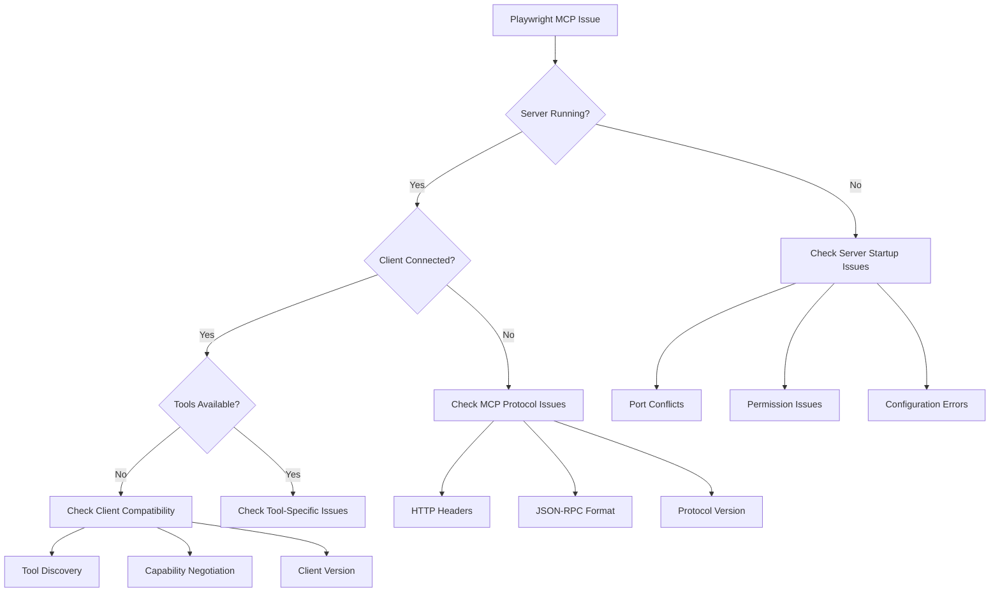

# Playwright MCP Comprehensive Troubleshooting Guide

## Table of Contents

1. [Quick Diagnosis Flowchart](#quick-diagnosis-flowchart)
2. [Installation Issues](#installation-issues)
3. [Browser Installation Problems](#browser-installation-problems)
4. [Server Startup Failures](#server-startup-failures)
5. [MCP Protocol Communication Issues](#mcp-protocol-communication-issues)
6. [Configuration Errors](#configuration-errors)
7. [Client Compatibility Problems](#client-compatibility-problems)
8. [Permission & Security Issues](#permission--security-issues)
9. [Platform-Specific Solutions](#platform-specific-solutions)
10. [Prevention Strategies](#prevention-strategies)
11. [Diagnostic Tools](#diagnostic-tools)

## Quick Diagnosis Flowchart



## Installation Issues

### Node.js Version Compatibility

**Error**: `Error: The module was compiled against a different Node.js version`

#### Diagnosis
```bash
# Check current Node.js version
node --version
# Expected: v18.x.x or higher
```

#### Solutions

**Option 1: Upgrade Node.js (Recommended)**
```bash
# Using nvm (Node Version Manager)
curl -o- https://raw.githubusercontent.com/nvm-sh/nvm/v0.39.0/install.sh | bash
source ~/.bashrc
nvm install 18
nvm use 18
nvm alias default 18

# Verify installation
node --version
npm --version
```

**Option 2: Use Container with Correct Node.js**
```dockerfile
FROM node:18-alpine
RUN npm install -g @playwright/mcp@latest
```

**Option 3: Use Package Manager**
```bash
# Ubuntu/Debian
curl -fsSL https://deb.nodesource.com/setup_18.x | sudo -E bash -
sudo apt-get install -y nodejs

# macOS
brew install node@18
brew link --overwrite node@18
```

#### Verification
```bash
# Reinstall Playwright MCP
npm uninstall -g @playwright/mcp
npm install -g @playwright/mcp@latest

# Test installation
npx @playwright/mcp@latest --help
```

### Dependency Resolution Conflicts

**Error**: `npm ERR! peer dep missing: playwright@^1.40.0`

#### Diagnosis
```bash
# Check installed Playwright version
npm list playwright
# Or globally
npm list -g playwright
```

#### Solutions

**Option 1: Install Compatible Versions**
```bash
# Clear npm cache first
npm cache clean --force

# Install specific compatible versions
npm install playwright@1.56.0
npm install @playwright/mcp@latest

# For global installation
npm install -g playwright@1.56.0
npm install -g @playwright/mcp@latest
```

**Option 2: Use Force Flag (Not Recommended for Production)**
```bash
npm install --force @playwright/mcp@latest
```

**Option 3: Resolve with Package-Lock**
```bash
# Remove existing lock files
rm package-lock.json
rm -rf node_modules

# Reinstall with fresh dependencies
npm install
npm install @playwright/mcp@latest
```

#### Verification
```bash
# Check both packages are installed
npm list playwright @playwright/mcp

# Test MCP server
npx @playwright/mcp@latest --help
```

## Browser Installation Problems

### Disk Space Constraints

**Error**: `Error: ENOSPC: no space left on device, write`

#### Diagnosis
```bash
# Check available disk space
df -h

# Check Playwright cache size
du -sh ~/.cache/ms-playwright/
```

#### Solutions

**Option 1: Install Chromium Only (Reduces Space to ~200MB)**
```bash
# Install only Chromium browser
npx playwright install chromium

# Verify installation
npx playwright install --dry-run
```

**Option 2: Use Docker Approach**
```bash
# Pull and run Docker image (includes browsers)
docker run -i --rm --init --pull=always mcr.microsoft.com/playwright/mcp

# For persistent configuration
docker run -d -i --rm --init --pull=always \
  --name playwright-mcp \
  -p 8931:8931 \
  mcr.microsoft.com/playwright/mcp \
  --port 8931
```

**Option 3: Clean Up Existing Installations**
```bash
# Remove all browser installations
npx playwright install --force --with-deps

# Reinstall with specific browsers only
npx playwright install chromium
```

**Option 4: Use Custom Cache Directory**
```bash
# Set custom cache location to drive with more space
export PLAYWRIGHT_BROWSERS_PATH=/path/to/drive/with/space
npx playwright install chromium
```

#### Verification
```bash
# Check browser installation
npx playwright install --dry-run

# Test browser launch
npx playwright codegen --device="Desktop Chrome" https://example.com
```

### Missing System Dependencies

**Error**: `Playwright Host validation warning: Missing libraries: libglib-2.0.so.0`

#### Diagnosis
```bash
# Check which libraries are missing
ldd $(which chromium) | grep "not found"

# Check system information
cat /etc/os-release
```

#### Solutions

**Option 1: Install System Dependencies (Ubuntu/Debian)**
```bash
# Update package lists
sudo apt-get update

# Install all required dependencies
sudo apt-get install -y \
    libglib2.0-0 \
    libnss3 \
    libnspr4 \
    libatk1.0-0 \
    libatk-bridge2.0-0 \
    libcups2 \
    libdrm2 \
    libxkbcommon0 \
    libxcomposite1 \
    libxdamage1 \
    libxfixes3 \
    libxrandr2 \
    libgbm1 \
    libasound2 \
    libxss1 \
    libappindicator3-1 \
    fonts-liberation \
    xdg-utils

# For headless operation in containers
sudo apt-get install -y \
    libgconf-2-4 \
    libxrandr2 \
    libasound2 \
    libpangocairo-1.0-0 \
    libatk1.0-0 \
    libcairo-gobject2 \
    libgtk-3-0 \
    libgdk-pixbuf2.0-0
```

**Option 2: Install System Dependencies (CentOS/RHEL)**
```bash
# Enable EPEL repository
sudo yum install -y epel-release

# Install required dependencies
sudo yum install -y \
    nss \
    atk \
    cups-libs \
    libXcomposite \
    libXcursor \
    libXdamage \
    libXext \
    libXi \
    libXrandr \
    libXScrnSaver \
    libXtst \
    pango \
    alsa-lib \
    gtk3 \
    libXScrnSaver \
    GConf2 \
    libXrandr \
    GConf2 \
    alsa-lib \
    pango \
    libXtst \
    xorg-x11-fonts-100dpi \
    xorg-x11-fonts-75dpi \
    xorg-x11-fonts-cyrillic \
    xorg-x11-fonts-misc \
    xorg-x11-fonts-Type1 \
    xorg-x11-utils
```

**Option 3: Use --no-sandbox Flag (For Containerized Environments)**
```bash
# Run with no-sandbox flag
npx @playwright/mcp@latest --no-sandbox

# For Docker, add security options
docker run --security-opt seccomp=unconfined mcr.microsoft.com/playwright/mcp
```

**Option 4: Use Playwright's Dependency Installer**
```bash
# Install all browser dependencies
npx playwright install-deps

# Or install dependencies for specific browser
npx playwright install-deps chromium
```

#### Verification
```bash
# Test browser launch
npx playwright launch --chromium

# Check if warnings are resolved
npx playwright install --dry-run
```

## Server Startup Failures

### Port Binding Conflicts

**Error**: `Error: listen EADDRINUSE: address already in use :::8931`

#### Diagnosis
```bash
# Find process using the port
lsof -i :8931
# Or
netstat -tulpn | grep 8931

# Check if it's a Playwright MCP process
ps aux | grep playwright
```

#### Solutions

**Option 1: Kill Conflicting Process**
```bash
# Find and kill the process
PID=$(lsof -t -i:8931)
kill -15 $PID  # Try graceful shutdown first

# If still running, force kill
kill -9 $PID

# Verify port is free
lsof -i :8931
```

**Option 2: Use Different Port**
```bash
# Start server on different port
npx @playwright/mcp@latest --port 8932

# Update configuration file
{
  "mcpServers": {
    "playwright": {
      "url": "http://localhost:8932/mcp"
    }
  }
}
```

**Option 3: Use Port Range (Advanced)**
```bash
# Find available port in range
PORT=$(shuf -i 8930-8940 -n 1)
npx @playwright/mcp@latest --port $PORT

# Update configuration dynamically
```

**Option 4: Configure Server to Bind to Specific Interface**
```bash
# Bind to localhost only (default)
npx @playwright/mcp@latest --host localhost --port 8931

# Bind to all interfaces (for Docker)
npx @playwright/mcp@latest --host 0.0.0.0 --port 8931
```

#### Verification
```bash
# Check if server is running on new port
curl http://localhost:8932/mcp

# Test MCP connection
curl -X POST \
  -H "Content-Type: application/json" \
  -H "Accept: application/json, text/event-stream" \
  -d '{"jsonrpc":"2.0","id":1,"method":"initialize","params":{}}' \
  http://localhost:8932/mcp
```

### Host Binding Restrictions

**Error**: `Error: listen EADDRNOTAVABLE: address not available`

#### Diagnosis
```bash
# Check available network interfaces
ip addr show
# Or
ifconfig

# Check which addresses are available
hostname -I
```

#### Solutions

**Option 1: Use Localhost (Default)**
```bash
# Bind to localhost (most reliable)
npx @playwright/mcp@latest --host localhost
```

**Option 2: Bind to All Interfaces (For Docker)**
```bash
# Bind to all interfaces
npx @playwright/mcp@latest --host 0.0.0.0

# For Docker, ensure port is exposed
docker run -p 8931:8931 mcr.microsoft.com/playwright/mcp
```

**Option 3: Use Specific IP Address**
```bash
# Find your IP address
IP=$(hostname -I | awk '{print $1}')

# Bind to specific IP
npx @playwright/mcp@latest --host $IP
```

**Option 4: Configure Docker Networking**
```bash
# Use host networking (advanced)
docker run --network=host mcr.microsoft.com/playwright/mcp

# Or use custom bridge network
docker network create mcp-network
docker run --network=mcp-network mcr.microsoft.com/playwright/mcp
```

#### Verification
```bash
# Test connection to bound address
curl http://localhost:8931/mcp
# Or
curl http://$IP:8931/mcp
```

## MCP Protocol Communication Issues

### HTTP Header Requirements

**Error**: `{"jsonrpc":"2.0","error":{"code":-32000,"message":"Not Acceptable: Client must accept both application/json and text/event-stream"}}`

#### Diagnosis
```bash
# Test with incorrect headers (should reproduce error)
curl -X POST \
  -H "Content-Type: application/json" \
  -d '{"jsonrpc":"2.0","id":1,"method":"initialize","params":{}}' \
  http://localhost:8931/mcp
```

#### Solutions

**Option 1: Use Correct Headers with curl**
```bash
# Correct request with all required headers
curl -X POST \
  -H "Content-Type: application/json" \
  -H "Accept: application/json, text/event-stream" \
  -d '{"jsonrpc":"2.0","id":1,"method":"initialize","params":{}}' \
  http://localhost:8931/mcp
```

**Option 2: Fix Custom MCP Client Implementation**
```javascript
// Node.js example with correct headers
const https = require('https');

const data = JSON.stringify({
  jsonrpc: "2.0",
  id: 1,
  method: "initialize",
  params: {
    protocolVersion: "2024-11-05",
    capabilities: {},
    clientInfo: {
      name: "test-client",
      version: "1.0.0"
    }
  }
});

const options = {
  hostname: 'localhost',
  port: 8931,
  path: '/mcp',
  method: 'POST',
  headers: {
    'Content-Type': 'application/json',
    'Accept': 'application/json, text/event-stream',
    'Content-Length': data.length
  }
};

const req = https.request(options, (res) => {
  console.log(`statusCode: ${res.statusCode}`);
  res.on('data', (d) => {
    process.stdout.write(d);
  });
});

req.on('error', (error) => {
  console.error(error);
});

req.write(data);
req.end();
```

**Option 3: Python Example with Correct Headers**
```python
import requests
import json

url = "http://localhost:8931/mcp"
headers = {
    "Content-Type": "application/json",
    "Accept": "application/json, text/event-stream"
}

data = {
    "jsonrpc": "2.0",
    "id": 1,
    "method": "initialize",
    "params": {
        "protocolVersion": "2024-11-05",
        "capabilities": {},
        "clientInfo": {
            "name": "test-client",
            "version": "1.0.0"
        }
    }
}

response = requests.post(url, headers=headers, json=data)
print(response.status_code)
print(response.text)
```

#### Verification
```bash
# Test with correct headers (should work)
curl -X POST \
  -H "Content-Type: application/json" \
  -H "Accept: application/json, text/event-stream" \
  -d '{"jsonrpc":"2.0","id":1,"method":"initialize","params":{}}' \
  http://localhost:8931/mcp
```

### JSON-RPC Protocol Version Mismatches

**Error**: `{"jsonrpc":"2.0","error":{"code":-32600,"message":"Invalid Request"}}`

#### Diagnosis
```bash
# Test with malformed JSON-RPC request
curl -X POST \
  -H "Content-Type: application/json" \
  -H "Accept: application/json, text/event-stream" \
  -d '{"invalid": "request"}' \
  http://localhost:8931/mcp
```

#### Solutions

**Option 1: Use Correct JSON-RPC 2.0 Format**
```bash
# Correct JSON-RPC 2.0 initialization request
curl -X POST \
  -H "Content-Type: application/json" \
  -H "Accept: application/json, text/event-stream" \
  -d '{
    "jsonrpc": "2.0",
    "id": 1,
    "method": "initialize",
    "params": {
      "protocolVersion": "2024-11-05",
      "capabilities": {
        "roots": {
          "listChanged": true
        },
        "sampling": {}
      },
      "clientInfo": {
        "name": "test-client",
        "version": "1.0.0"
      }
    }
  }' \
  http://localhost:8931/mcp
```

**Option 2: Implement Proper JSON-RPC Client**
```javascript
// Complete JSON-RPC client implementation
class JSONRPCClient {
  constructor(url) {
    this.url = url;
    this.id = 1;
  }

  async request(method, params = {}) {
    const response = await fetch(this.url, {
      method: 'POST',
      headers: {
        'Content-Type': 'application/json',
        'Accept': 'application/json, text/event-stream'
      },
      body: JSON.stringify({
        jsonrpc: '2.0',
        id: this.id++,
        method,
        params
      })
    });

    const data = await response.json();
    
    if (data.error) {
      throw new Error(`JSON-RPC Error: ${data.error.message}`);
    }
    
    return data.result;
  }

  async initialize() {
    return await this.request('initialize', {
      protocolVersion: '2024-11-05',
      capabilities: {
        roots: {
          listChanged: true
        },
        sampling: {}
      },
      clientInfo: {
        name: 'test-client',
        version: '1.0.0'
      }
    });
  }

  async listTools() {
    return await this.request('tools/list');
  }
}

// Usage example
const client = new JSONRPCClient('http://localhost:8931/mcp');
await client.initialize();
const tools = await client.listTools();
console.log(tools);
```

#### Verification
```bash
# Test with correct JSON-RPC format
curl -X POST \
  -H "Content-Type: application/json" \
  -H "Accept: application/json, text/event-stream" \
  -d '{
    "jsonrpc": "2.0",
    "id": 1,
    "method": "initialize",
    "params": {
      "protocolVersion": "2024-11-05",
      "capabilities": {},
      "clientInfo": {
        "name": "test-client",
        "version": "1.0.0"
      }
    }
  }' \
  http://localhost:8931/mcp
```

## Configuration Errors

### .kilocode/mcp.json Syntax Errors

**Error**: `Error: Failed to parse MCP configuration file`

#### Diagnosis
```bash
# Validate JSON syntax
cat .kilocode/mcp.json | jq .

# Or use online JSON validator
# Check for common syntax errors:
# - Missing commas
# - Trailing commas
# - Incorrect quotes
# - Mismatched brackets
```

#### Solutions

**Option 1: Use Correct Configuration Template**
```json
{
  "mcpServers": {
    "playwright": {
      "command": "npx",
      "args": [
        "@playwright/mcp@latest",
        "--browser",
        "chromium",
        "--headless",
        "--port",
        "8931"
      ]
    }
  }
}
```

**Option 2: Use HTTP Endpoint Configuration**
```json
{
  "mcpServers": {
    "playwright": {
      "url": "http://localhost:8931/mcp"
    }
  }
}
```

**Option 3: Advanced Configuration with All Options**
```json
{
  "mcpServers": {
    "playwright": {
      "command": "npx",
      "args": [
        "@playwright/mcp@latest",
        "--browser",
        "chromium",
        "--headless",
        "--no-sandbox",
        "--port",
        "8931",
        "--timeout-action",
        "10000",
        "--timeout-navigation",
        "60000"
      ],
      "env": {
        "PLAYWRIGHT_BROWSER_PATH": "/usr/bin/chromium"
      }
    }
  }
}
```

**Option 4: Docker Configuration**
```json
{
  "mcpServers": {
    "playwright": {
      "command": "docker",
      "args": [
        "run",
        "-i",
        "--rm",
        "--init",
        "--pull=always",
        "-p",
        "8931:8931",
        "mcr.microsoft.com/playwright/mcp",
        "--port",
        "8931"
      ]
    }
  }
}
```

#### Verification
```bash
# Validate JSON syntax
jq . .kilocode/mcp.json

# Test configuration by restarting MCP client
# Check if server starts correctly
```

### Command vs URL Configuration Conflicts

**Error**: `Error: Cannot specify both 'command' and 'url' for MCP server`

#### Diagnosis
```bash
# Check configuration file
cat .kilocode/mcp.json | grep -E "(command|url)"
```

#### Solutions

**Option 1: Use Command Configuration Only**
```json
{
  "mcpServers": {
    "playwright": {
      "command": "npx",
      "args": ["@playwright/mcp@latest"]
    }
  }
}
```

**Option 2: Use URL Configuration Only (For Standalone Server)**
```json
{
  "mcpServers": {
    "playwright": {
      "url": "http://localhost:8931/mcp"
    }
  }
}
```

**Option 3: Migration from Command to URL**
```bash
# Step 1: Start standalone server
npx @playwright/mcp@latest --port 8931

# Step 2: Update configuration to use URL
{
  "mcpServers": {
    "playwright": {
      "url": "http://localhost:8931/mcp"
    }
  }
}

# Step 3: Restart MCP client
```

#### Verification
```bash
# Validate configuration has only one method
jq '.mcpServers.playwright | keys' .kilocode/mcp.json
# Should return either ["command"] or ["url"], not both
```

## Client Compatibility Problems

### Tool Discovery Failures

**Error**: `No tools available from playwright MCP server`

#### Diagnosis
```bash
# Check if server is running
curl http://localhost:8931/mcp

# Check server logs for errors
# Test MCP connection manually
curl -X POST \
  -H "Content-Type: application/json" \
  -H "Accept: application/json, text/event-stream" \
  -d '{"jsonrpc":"2.0","id":1,"method":"tools/list","params":{}}' \
  http://localhost:8931/mcp
```

#### Solutions

**Option 1: Restart MCP Client**
```bash
# Stop MCP client
# Start MCP client again
# This refreshes server connections
```

**Option 2: Verify Server Configuration**
```bash
# Check server is running with correct options
ps aux | grep playwright

# Restart server if needed
pkill -f "playwright.*mcp"
npx @playwright/mcp@latest --port 8931
```

**Option 3: Test with Minimal Configuration**
```json
{
  "mcpServers": {
    "playwright": {
      "command": "npx",
      "args": ["@playwright/mcp@latest"]
    }
  }
}
```

**Option 4: Check Client-Side Configuration**
```javascript
// Ensure client is properly initialized
const client = new MCPClient();
await client.connect();

// List available tools
const tools = await client.listTools();
console.log('Available tools:', tools);
```

#### Verification
```bash
# Test tools list endpoint
curl -X POST \
  -H "Content-Type: application/json" \
  -H "Accept: application/json, text/event-stream" \
  -d '{"jsonrpc":"2.0","id":1,"method":"tools/list","params":{}}' \
  http://localhost:8931/mcp
```

### MCP Client Version Incompatibilities

**Error**: `Error: MCP protocol version mismatch`

#### Diagnosis
```bash
# Check MCP client version
npm list @modelcontextprotocol/sdk

# Check server protocol version
curl -X POST \
  -H "Content-Type: application/json" \
  -H "Accept: application/json, text/event-stream" \
  -d '{"jsonrpc":"2.0","id":1,"method":"initialize","params":{}}' \
  http://localhost:8931/mcp | jq '.result.protocolVersion'
```

#### Solutions

**Option 1: Update MCP Client**
```bash
# Update to latest version
npm update @modelcontextprotocol/sdk

# Or install specific version
npm install @modelcontextprotocol/sdk@latest
```

**Option 2: Use Compatible Server Version**
```bash
# Install specific server version
npm install @playwright/mcp@0.0.41

# Or use latest
npm install @playwright/mcp@latest
```

**Option 3: Force Protocol Version**
```javascript
// Force specific protocol version in client
const client = new MCPClient({
  protocolVersion: '2024-11-05'
});
```

#### Verification
```bash
# Check protocol versions match
CLIENT_VERSION=$(npm list @modelcontextprotocol/sdk | grep @modelcontextprotocol/sdk)
SERVER_VERSION=$(curl -s -X POST \
  -H "Content-Type: application/json" \
  -H "Accept: application/json, text/event-stream" \
  -d '{"jsonrpc":"2.0","id":1,"method":"initialize","params":{}}' \
  http://localhost:8931/mcp | jq -r '.result.protocolVersion')

echo "Client version: $CLIENT_VERSION"
echo "Server protocol: $SERVER_VERSION"
```

## Permission & Security Issues

### Browser Sandbox Restrictions

**Error**: `Error: Failed to launch browser: No usable sandbox!`

#### Diagnosis
```bash
# Check if running in container
cat /proc/1/cgroup | grep docker

# Check user permissions
id

# Test browser launch directly
npx playwright launch --chromium
```

#### Solutions

**Option 1: Use --no-sandbox Flag (For Containerized Environments)**
```bash
# Run with no-sandbox flag
npx @playwright/mcp@latest --no-sandbox

# Add to configuration
{
  "mcpServers": {
    "playwright": {
      "command": "npx",
      "args": [
        "@playwright/mcp@latest",
        "--no-sandbox"
      ]
    }
  }
}
```

**Option 2: Configure Proper Docker Sandbox**
```bash
# Run with additional capabilities
docker run --cap-add=SYS_ADMIN mcr.microsoft.com/playwright/mcp

# Or with seccomp disabled
docker run --security-opt seccomp=unconfined mcr.microsoft.com/playwright/mcp
```

**Option 3: Use User Namespaces**
```bash
# Run with host user namespace
docker run --userns=host mcr.microsoft.com/playwright/mcp

# Or with specific user mapping
docker run --user=$(id -u):$(id -g) mcr.microsoft.com/playwright/mcp
```

**Option 4: Configure Kernel Parameters**
```bash
# Enable user namespaces (requires root)
echo 'user.max_user_namespaces=15000' | sudo tee -a /etc/sysctl.conf
sudo sysctl -p

# Add user to /etc/subuid and /etc/subuid
echo "$(id -un):100000:65536" | sudo tee -a /etc/subuid
echo "$(id -un):100000:65536" | sudo tee -a /etc/subgid
```

#### Verification
```bash
# Test browser launch with no-sandbox
npx playwright launch --chromium --no-sandbox

# Test MCP server with no-sandbox
npx @playwright/mcp@latest --no-sandbox --port 8931
```

### File System Access Limitations

**Error**: `Error: EACCES: permission denied, access '/path/to/file'`

#### Diagnosis
```bash
# Check file permissions
ls -la /path/to/file

# Check user permissions
id

# Check directory permissions
ls -ld /path/to/directory
```

#### Solutions

**Option 1: Set Proper File Permissions**
```bash
# Set directory permissions
chmod 755 /path/to/directory

# Set file permissions
chmod 644 /path/to/file

# Set ownership if needed
sudo chown -R $USER:$USER /path/to/directory
```

**Option 2: Use Appropriate User in Docker**
```bash
# Run with current user ID
docker run -u $(id -u):$(id -g) mcr.microsoft.com/playwright/mcp

# Or create user with specific ID
docker run --user=1000:1000 mcr.microsoft.com/playwright/mcp
```

**Option 3: Configure Output Directory**
```bash
# Use directory with write permissions
npx @playwright/mcp@latest --output-dir /tmp/playwright-output

# Create directory if needed
mkdir -p /tmp/playwright-output
chmod 755 /tmp/playwright-output
```

**Option 4: Use Volume Mounts in Docker**
```bash
# Mount directory with proper permissions
docker run -v /path/to/output:/output mcr.microsoft.com/playwright/mcp

# Or mount with specific permissions
docker run -v /path/to/output:/output:rw mcr.microsoft.com/playwright/mcp
```

#### Verification
```bash
# Test file creation
touch /tmp/playwright-output/test.txt

# Test MCP server with output directory
npx @playwright/mcp@latest --output-dir /tmp/playwright-output
```

## Platform-Specific Solutions

### Linux/Ubuntu

#### Most Common Issues:
1. Missing system dependencies
2. Permission issues with sandbox
3. Port conflicts in containerized environments

#### Quick Fix Script:
```bash
#!/bin/bash
# Playwright MCP Ubuntu Setup Script

# Update system
sudo apt-get update

# Install system dependencies
sudo apt-get install -y \
    curl \
    gnupg \
    ca-certificates \
    libglib2.0-0 \
    libnss3 \
    libnspr4 \
    libatk1.0-0 \
    libatk-bridge2.0-0 \
    libcups2 \
    libdrm2 \
    libxkbcommon0 \
    libxcomposite1 \
    libxdamage1 \
    libxfixes3 \
    libxrandr2 \
    libgbm1 \
    libasound2

# Install Node.js 18
curl -fsSL https://deb.nodesource.com/setup_18.x | sudo -E bash -
sudo apt-get install -y nodejs

# Install Playwright MCP
npm install -g @playwright/mcp@latest

# Install browser
npx playwright install chromium

# Test installation
npx @playwright/mcp@latest --help
```

### macOS

#### Most Common Issues:
1. Port binding conflicts
2. Node.js version compatibility
3. Browser installation timeouts

#### Quick Fix Script:
```bash
#!/bin/bash
# Playwright MCP macOS Setup Script

# Install Homebrew if not present
if ! command -v brew &> /dev/null; then
    /bin/bash -c "$(curl -fsSL https://raw.githubusercontent.com/Homebrew/install/HEAD/install.sh)"
fi

# Install Node.js 18
brew install node@18
brew link --overwrite node@18

# Install Playwright MCP
npm install -g @playwright/mcp@latest

# Install browser
npx playwright install chromium

# Test installation
npx @playwright/mcp@latest --help
```

### Windows

#### Most Common Issues:
1. Path length limitations
2. Permission issues with browser installation
3. Antivirus software interference

#### Quick Fix Script (PowerShell):
```powershell
# Playwright MCP Windows Setup Script

# Install Chocolatey if not present
if (!(Get-Command choco -ErrorAction SilentlyContinue)) {
    Set-ExecutionPolicy Bypass -Scope Process -Force
    [System.Net.ServicePointManager]::SecurityProtocol = [System.Net.ServicePointManager]::SecurityProtocol -bor 3072
    iex ((New-Object System.Net.WebClient).DownloadString('https://community.chocolatey.org/install.ps1'))
}

# Install Node.js 18
choco install nodejs --version=18.17.0

# Refresh PATH
$env:PATH = [System.Environment]::GetEnvironmentVariable("PATH","Machine") + ";" + [System.Environment]::GetEnvironmentVariable("PATH","User")

# Install Playwright MCP
npm install -g @playwright/mcp@latest

# Install browser
npx playwright install chromium

# Test installation
npx @playwright/mcp@latest --help
```

### Docker/Containerized Environments

#### Most Common Issues:
1. Sandbox restrictions
2. Missing system libraries
3. Disk space constraints

#### Dockerfile Solution:
```dockerfile
FROM node:18-alpine

# Install system dependencies
RUN apk add --no-cache \
    chromium \
    nss \
    freetype \
    freetype-dev \
    harfbuzz \
    ca-certificates \
    ttf-freefont

# Set Puppeteer to use installed Chromium
ENV PUPPETEER_SKIP_CHROMIUM_DOWNLOAD=true \
    PUPPETEER_EXECUTABLE_PATH=/usr/bin/chromium-browser

# Install Playwright MCP
RUN npm install -g @playwright/mcp@latest

# Create output directory
RUN mkdir -p /output && chmod 755 /output

# Expose port
EXPOSE 8931

# Run with no-sandbox
CMD ["npx", "@playwright/mcp@latest", "--no-sandbox", "--port", "8931"]
```

## Prevention Strategies

### System Preparation

#### 1. Environment Setup Script
```bash
#!/bin/bash
# Playwright MCP Environment Setup

# Check Node.js version
NODE_VERSION=$(node --version | cut -d'v' -f2)
REQUIRED_VERSION="18.0.0"

if [ "$(printf '%s\n' "$REQUIRED_VERSION" "$NODE_VERSION" | sort -V | head -n1)" != "$REQUIRED_VERSION" ]; then
    echo "Error: Node.js version $NODE_VERSION is too old. Required: $REQUIRED_VERSION or higher"
    exit 1
fi

# Check available disk space (minimum 1GB)
AVAILABLE_SPACE=$(df . | tail -1 | awk '{print $4}')
REQUIRED_SPACE=1048576  # 1GB in KB

if [ "$AVAILABLE_SPACE" -lt "$REQUIRED_SPACE" ]; then
    echo "Warning: Low disk space. Available: $((AVAILABLE_SPACE / 1024))MB, Required: 1GB"
fi

# Check if port 8931 is available
if lsof -i :8931 > /dev/null 2>&1; then
    echo "Warning: Port 8931 is already in use"
fi

# Create output directory
mkdir -p ./playwright-output
chmod 755 ./playwright-output

echo "Environment setup complete"
```

#### 2. Configuration Validation Script
```bash
#!/bin/bash
# Playwright MCP Configuration Validation

CONFIG_FILE=".kilocode/mcp.json"

# Check if configuration file exists
if [ ! -f "$CONFIG_FILE" ]; then
    echo "Error: Configuration file $CONFIG_FILE not found"
    exit 1
fi

# Validate JSON syntax
if ! jq empty "$CONFIG_FILE" 2>/dev/null; then
    echo "Error: Invalid JSON syntax in $CONFIG_FILE"
    exit 1
fi

# Check for conflicting configuration
if jq -e '.mcpServers.playwright.command' "$CONFIG_FILE" > /dev/null && \
   jq -e '.mcpServers.playwright.url' "$CONFIG_FILE" > /dev/null; then
    echo "Error: Both 'command' and 'url' specified in configuration"
    exit 1
fi

echo "Configuration validation complete"
```

### Monitoring and Maintenance

#### 1. Health Check Script
```bash
#!/bin/bash
# Playwright MCP Health Check

# Check if server is running
if ! curl -s http://localhost:8931/mcp > /dev/null; then
    echo "Error: Playwright MCP server is not running"
    exit 1
fi

# Check MCP protocol communication
RESPONSE=$(curl -s -X POST \
    -H "Content-Type: application/json" \
    -H "Accept: application/json, text/event-stream" \
    -d '{"jsonrpc":"2.0","id":1,"method":"initialize","params":{}}' \
    http://localhost:8931/mcp)

if ! echo "$RESPONSE" | jq -e '.result.protocolVersion' > /dev/null; then
    echo "Error: MCP protocol communication failed"
    exit 1
fi

# Check tools availability
TOOLS_RESPONSE=$(curl -s -X POST \
    -H "Content-Type: application/json" \
    -H "Accept: application/json, text/event-stream" \
    -d '{"jsonrpc":"2.0","id":2,"method":"tools/list","params":{}}' \
    http://localhost:8931/mcp)

if ! echo "$TOOLS_RESPONSE" | jq -e '.result.tools' > /dev/null; then
    echo "Error: No tools available from server"
    exit 1
fi

echo "Health check complete - all systems operational"
```

#### 2. Log Monitoring Script
```bash
#!/bin/bash
# Playwright MCP Log Monitor

LOG_FILE="./playwright-mcp.log"

# Monitor for common errors
tail -f "$LOG_FILE" | grep --line-buffered -E \
    -e "Error: listen EADDRINUSE" \
    -e "Error: ENOSPC" \
    -e "Error: Failed to launch browser" \
    -e "Error: Not Acceptable" \
    -e "Error: Invalid Request" | while read line; do
    
    echo "ALERT: $line"
    
    # Send notification (optional)
    # notify-send "Playwright MCP Error" "$line"
done
```

## Diagnostic Tools

### 1. System Information Script
```bash
#!/bin/bash
# Playwright MCP System Information

echo "=== System Information ==="
echo "OS: $(uname -s)"
echo "Kernel: $(uname -r)"
echo "Architecture: $(uname -m)"

echo -e "\n=== Node.js Information ==="
echo "Node.js: $(node --version)"
echo "npm: $(npm --version)"

echo -e "\n=== Playwright Information ==="
echo "Playwright: $(npx playwright --version)"
echo "Playwright MCP: $(npm list -g @playwright/mcp 2>/dev/null | grep @playwright/mcp || echo 'Not installed globally')"

echo -e "\n=== Browser Information ==="
npx playwright install --dry-run

echo -e "\n=== Network Information ==="
echo "Port 8931 status: $(lsof -i :8931 > /dev/null 2>&1 && echo 'In use' || echo 'Available')"
echo "Local IP: $(hostname -I | awk '{print $1}')"

echo -e "\n=== Disk Information ==="
df -h | grep -E "Filesystem|/dev/"

echo -e "\n=== Memory Information ==="
free -h
```

### 2. Connection Test Script
```bash
#!/bin/bash
# Playwright MCP Connection Test

SERVER_URL="http://localhost:8931/mcp"

echo "Testing connection to $SERVER_URL"

# Test basic HTTP connection
echo -n "HTTP connection: "
if curl -s "$SERVER_URL" > /dev/null; then
    echo "OK"
else
    echo "FAILED"
    exit 1
fi

# Test MCP initialization
echo -n "MCP initialization: "
INIT_RESPONSE=$(curl -s -X POST \
    -H "Content-Type: application/json" \
    -H "Accept: application/json, text/event-stream" \
    -d '{"jsonrpc":"2.0","id":1,"method":"initialize","params":{}}' \
    "$SERVER_URL")

if echo "$INIT_RESPONSE" | jq -e '.result.protocolVersion' > /dev/null; then
    echo "OK"
    PROTOCOL_VERSION=$(echo "$INIT_RESPONSE" | jq -r '.result.protocolVersion')
    echo "  Protocol version: $PROTOCOL_VERSION"
else
    echo "FAILED"
    echo "$INIT_RESPONSE"
    exit 1
fi

# Test tools listing
echo -n "Tools listing: "
TOOLS_RESPONSE=$(curl -s -X POST \
    -H "Content-Type: application/json" \
    -H "Accept: application/json, text/event-stream" \
    -d '{"jsonrpc":"2.0","id":2,"method":"tools/list","params":{}}' \
    "$SERVER_URL")

if echo "$TOOLS_RESPONSE" | jq -e '.result.tools' > /dev/null; then
    echo "OK"
    TOOLS_COUNT=$(echo "$TOOLS_RESPONSE" | jq '.result.tools | length')
    echo "  Available tools: $TOOLS_COUNT"
else
    echo "FAILED"
    echo "$TOOLS_RESPONSE"
    exit 1
fi

echo "Connection test complete - all tests passed"
```

### 3. Error Recovery Script
```bash
#!/bin/bash
# Playwright MCP Error Recovery

echo "Starting Playwright MCP error recovery..."

# Kill existing processes
echo "Stopping existing Playwright MCP processes..."
pkill -f "playwright.*mcp" || true

# Clear npm cache
echo "Clearing npm cache..."
npm cache clean --force

# Reinstall packages
echo "Reinstalling packages..."
npm uninstall -g @playwright/mcp
npm install -g @playwright/mcp@latest

# Reinstall browsers
echo "Reinstalling browsers..."
npx playwright install --force chromium

# Start server
echo "Starting Playwright MCP server..."
npx @playwright/mcp@latest --browser chromium --headless --no-sandbox --port 8931 &

# Wait for server to start
sleep 5

# Test connection
echo "Testing server connection..."
if curl -s http://localhost:8931/mcp > /dev/null; then
    echo "Recovery complete - server is running"
else
    echo "Recovery failed - server not responding"
    exit 1
fi
```

## Conclusion

This comprehensive troubleshooting guide covers the most common issues encountered when working with Playwright MCP. By following the diagnostic steps and solutions provided, developers can quickly identify and resolve problems, ensuring a stable and reliable MCP environment.

The key to successful troubleshooting is:

1. **Systematic Diagnosis**: Use the provided diagnostic tools to identify the root cause
2. **Platform-Specific Solutions**: Apply the appropriate fixes for your operating system
3. **Prevention**: Implement the monitoring and maintenance scripts to prevent future issues
4. **Documentation**: Keep track of any unique issues encountered in your environment

For additional support, refer to the official Playwright MCP documentation and community forums.

---
**Document Created**: 2025-10-08T07:32:05.022Z  
**Status**: Comprehensive Troubleshooting Guide Complete  
**Version**: 1.0